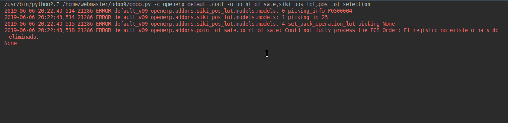
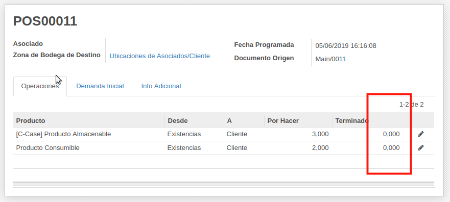
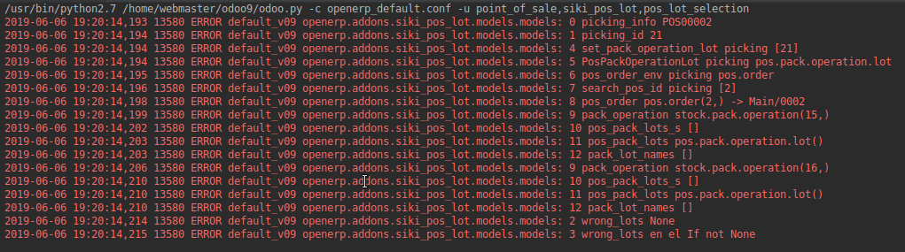
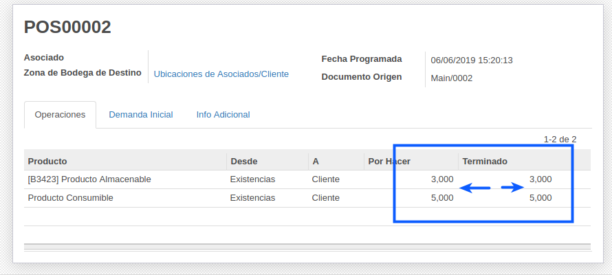
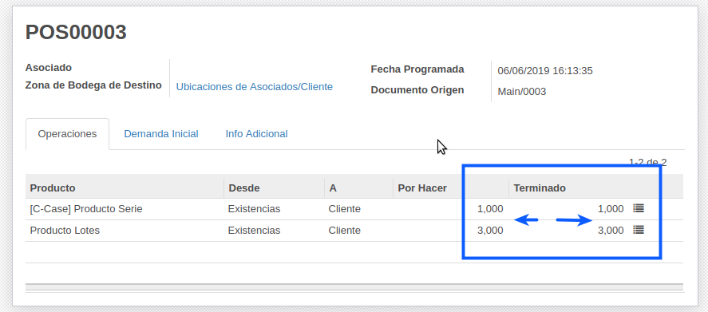

# Requerimiento SIKI pos lot

## Descripción: 

Desarrollo de funcionlidad de lotes a partir de la App Point_of_sale version 11 para la version 9

## Nombre de la Aplicacion Final: 

siki_pos_lot

### Nota IMportante

Se verifica el código y se confirma el uso de Métodos del Core POS Version 11

A realizar comparación con el código del POS Version 11, se percibe que en siki pos lot existen líneas de código omitidas, se válida que las mismas no sean estrictamente necesarias para el funcionamiento del POS y sus diferentes variantes en cuanto producto rastreables

## Lista de Modificaciones

* V.-1.0 Se corrige la falta de asignación de cantidades en los productos de lotes y serial en la linea de orden
* V.-1.1 Se incorporan reglas de acceso para correcta funcionalidad en multiples cajas - Importante: en la asignacion de permiso al grupo, se debe colocar el module al que se hace referencia en nuestro caso point_of_sale
 * Permisos:
    * model_pos_pack_operation_lot
    * model_stock_production_lot
* V.-2.0 Se corrige error de asignacion de cantidades de productos en la orden de entrega


### Fase de Prueba : 

#### White Box / Test de Caja Blanca 001

Error, al seleccionar un prodcuto lote o serial , la asignación de cantidad no se actualiza 

Código encontrado incompleto 

``` ../siki_pos_lot/static/src/js/pos.js
 set_quantity_by_lot: function() {
      var valid_lots = this.get_valid_lots();
      this.order_line.set_quantity(valid_lots.length);
  }
```
Se actualizo de acuerdo el código completo del core 11

```  ../siki_pos_lot/static/src/js/pos.js
set_quantity_by_lot: function() {
        if (this.order_line.product.tracking == 'serial') {
            var valid_lots_quantity = this.get_valid_lots().length;
            if (this.order_line.quantity < 0){
                valid_lots_quantity = -valid_lots_quantity;
            }
            this.order_line.set_quantity(valid_lots_quantity);
        }
    }
```

#### White Box / Test de Caja Blanca 002

* V.-2.0 Se corrige error de asignacion de cantidades de productos en la orden de entrega
* Se realizarón diferente pruebas de funcionalidad con diferentes variables, [Ver Pruebas](https://docs.google.com/spreadsheets/d/1fgJCBGUPm9i0FuufIGyPcttwbkDpb9LLXH0xId0Xz2I/edit?usp=sharing)


#### Desarrollo

Metodo involucrados
* _force_picking_done()
* set_pack_operation_lot()
* Ruta: /home/webmaster/odoo9/addons_custom/siki_pos_lot/models/models.py

Se detecta que desde el método _force_picking_done() se llama al método set_pack_operation_lot() con parámetros de la api.old (Api Vieja), y este método esta desarrollado con estructura y parámetros de la Api.New (api nueva), lo que hace incompatible la transferencia de data de entre estos dos métodos

Ej. wrong_lots = self.set_pack_operation_lot(cr, uid, [picking_id], context=context) -> llama al método set_pack_operation_lot, pero el método al ser llamado no recibe de manera correcta los argumentos cr, uid, context, ya que no esta preparado para hacerlo con la APi.Old, si no con la nueva: def set_pack_operation_lot(self, picking=None)

```  ../siki_pos_lot/models/models.py

    def _force_picking_done(self, cr, uid, picking_id, context=None):
        ...
        wrong_lots = self.set_pack_operation_lot_HENRY(cr, uid, [picking_id], context=context)
        
       La vairable  wrong_lots trae como respuesta un none, lo cual no es procesado adecuadamente por el condicional
        if not wrong_lots:
            _logger.error('3 wrong_lots en el If not %s', wrong_lots)
       ...
       
     @api.multi
    def set_pack_operation_lot_ALEJANDRO(self, picking=None):
        """Set Serial/Lot number in pack operations to mark the pack operation done."""
        _logger.error('4 set_pack_operation_lot picking %s', picking)
        StockProductionLot = self.env['stock.production.lot']
        PosPackOperationLot = self.env['pos.pack.operation.lot']
        has_wrong_lots = False
        #pic = self.env['stock.picking'].browse(picking)
        #import pdb; pdb.set_trace()
        for order in self:
            for pack_operation in order.picking_id.pack_operation_ids:
                qty = 0
                qty_done = 0
                pack_lots = []
                pos_pack_lots = PosPackOperationLot.search([('order_id', '=',  order.id), ('product_id', '=', pack_operation.product_id.id)])
                pack_lot_names = [pos_pack.lot_name for pos_pack in pos_pack_lots]

                if pack_lot_names:
                    for lot_name in list(set(pack_lot_names)):
                        stock_production_lot = StockProductionLot.search([('name', '=', lot_name), ('product_id', '=', pack_operation.product_id.id)])
                        if stock_production_lot:
                            if stock_production_lot.product_id.tracking == 'lot':
                                qty =  pos_pack_lots.pos_order_line_id.qty
                            else:
                                qty = 1.0
                            qty_done += qty
                            pack_lots.append({'lot_id': stock_production_lot.id, 'qty': qty})
                        else:
                            has_wrong_lots = True
                else:
                    qty_done = pack_operation.product_qty
                pack_operation.write({'pack_lot_ids': map(lambda x: (0, 0, x), pack_lots), 'qty_done': qty_done})   
     
```


Al verificar la traza de la función, al entrar en el método set_pack_operation_lot, el parámetro picking no tiene ningún valor, el mismo es importante para la correcta continuidad de funciones dentre de este

     
#### Anexo Error que se desea corrergir



##### Corrección de error

Se utiliza funcionalidad de la Api.Old en el método set_pack_operation_lot, lo que hace variar drásticamente la estructura del mismo más no, su funcionalidad para lograr ejecutar todo el código que lo integra

```  ../siki_pos_lot/models/models.py

    def _force_picking_done(self, cr, uid, picking_id, context=None):
        ...
        wrong_lots = self.set_pack_operation_lot_HENRY(cr, uid, [picking_id], context=context)
        
       
        if not wrong_lots:
            _logger.error('3 wrong_lots en el If not %s', wrong_lots)
       ...
       
        def set_pack_operation_lot_HENRY(self, cr, uid, picking, context=None):
        """Set Serial/Lot number in pack operations to mark the pack operation done."""
        _logger.error('4 set_pack_operation_lot picking %s', picking)

        #Se debe obtener los modelos con la API old
        StockProductionLot = self.pool.get('stock.production.lot')
        PosPackOperationLot = self.pool.get('pos.pack.operation.lot')
        _logger.error('5 PosPackOperationLot picking %s', PosPackOperationLot)
        PosOrderModel = self.pool.get('pos.order')
        _logger.error('6 pos_order_env picking %s', PosOrderModel)

        #Buscar el id de la Orden generada por el POS de acuerdo al valor picking que llega en la funcion
        search_pos_id = PosOrderModel.search(cr, uid, [('picking_id', '=', picking)], context=context)
        _logger.error('7 search_pos_id picking %s', search_pos_id)

        #Objet de la Orden del POs, similiar al Self que se generaria en la API New
        pos_order = PosOrderModel.browse(cr, uid, search_pos_id, context=context)
        _logger.error('8 pos_order %s -> %s', pos_order, pos_order.name)

        has_wrong_lots = False
        # pic = self.env['stock.picking'].browse(picking)
        # import pdb; pdb.set_trace()
        for order in pos_order:
            for pack_operation in order.picking_id.pack_operation_ids:
                _logger.error('9 pack_operation %s', pack_operation)
                qty = 0
                qty_done = 0
                pack_lots = []
                #Se debe utilizar Api Old para search en pos_pack_lots
                pos_pack_lots_s = PosPackOperationLot.search(cr, uid,
                    [('order_id', '=', order.id), ('product_id', '=', pack_operation.product_id.id)], context=context)
                _logger.error('10 pos_pack_lots_s %s', pos_pack_lots_s)

                #pos_pack_lots de ser un objeto
                pos_pack_lots = PosPackOperationLot.browse(cr, uid, pos_pack_lots_s, context=context)
                _logger.error('11 pos_pack_lots %s', pos_pack_lots)

                pack_lot_names = [pos_pack.lot_name for pos_pack in pos_pack_lots]
                _logger.error('12 pack_lot_names %s', pack_lot_names)

                if pack_lot_names:
                    for lot_name in list(set(pack_lot_names)):
                        stock_production_lot_s = StockProductionLot.search(cr, uid,
                            [('name', '=', lot_name), ('product_id', '=', pack_operation.product_id.id)], context=context)
                        _logger.error('13 stock_production_lot_s %s', stock_production_lot_s)

                        # stock_production_lot debe ser un objeto
                        stock_production_lot = StockProductionLot.browse(cr, uid, stock_production_lot_s, context=context)

                        if stock_production_lot:
                            _logger.error('14 stock_production_lot %s', stock_production_lot)

                            if stock_production_lot.product_id.tracking == 'lot':
                                _logger.error('15 pos_pack_lots.pos_order_line_id.qty %s', pos_pack_lots.pos_order_line_id.qty)

                                qty = pos_pack_lots.pos_order_line_id.qty
                            else:
                                qty = 1.0
                            qty_done += qty
                            pack_lots.append({'lot_id': stock_production_lot.id, 'qty': qty})
                        else:
                            has_wrong_lots = True
                else:
                    qty_done = pack_operation.product_qty
                pack_operation.write({'pack_lot_ids': map(lambda x: (0, 0, x), pack_lots), 'qty_done': qty_done})   
     
```

Al verificar nuevamente la traza del código, podemos observar una traza más extensa que recorre todo el método set_pack_operation_lot hasta retornar un resultado satisfactorio para la variable wrond_lots


#### Anexos, Error Corregido

Se asigna de manera automática cantidad de inventario para los productos de tipo almacenable y consumible


Se asigna de manera automática Némero de Serie / Número de Lote y sus respectivas cantidades para los productos que dispone de ratreo



#### White Box / Test de Caja Blanca 003

Error: al selecionar varios productos tipo lote , la selección se suma en una misma linea de orden, la funcionalidad correcta debe ser que por cada producto tipo lote seleccionado , se debe crear una linea nueva (luego se puede seleccionar las cantidades a traves de teclado)

NOTAÑ se percibe código omitido del POS 11 y otro comentado que puede tener repercuciones importantes para la ejecución del codigo en esta variante

---------------------
---------------------
